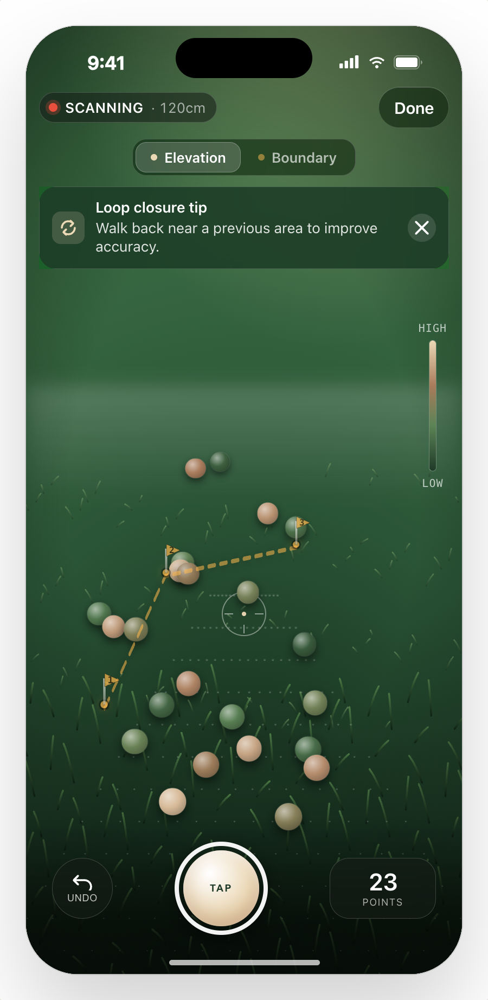
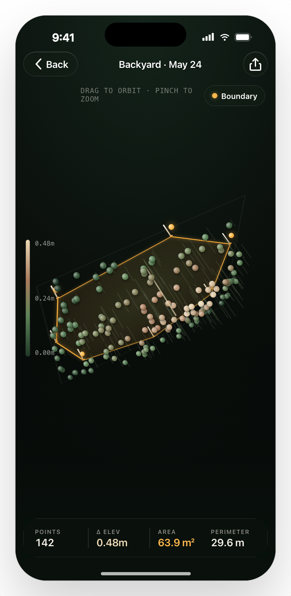

# Garden Mapper

Map your lawn's topography using iPhone LiDAR. Walk your garden with the phone on a stick, capture elevation points, mark boundary stakes, then view and export a 3D point cloud.

<p align="center">
  
  &nbsp;&nbsp;&nbsp;&nbsp;
  
</p>

## How It Works

1. **Setup** — Set your stick height (phone mounted on a monopod/stick at a fixed height)
2. **Scan** — Walk the garden tapping to capture elevation points. Switch to boundary mode to mark the perimeter with stakes
3. **View** — Orbit a 3D point cloud colored by relative elevation (low = moss green, high = cream)
4. **Export** — Share as `.ply` (for MeshLab, CloudCompare, Blender) or `.csv` (spreadsheet-friendly)

## Requirements

- iPhone 12 Pro or later (LiDAR sensor required)
- iOS 16.0+

## Building

```bash
# Build for a connected device
xcodebuild -project GardenMapper.xcodeproj \
  -scheme GardenMapper \
  -destination 'generic/platform=iOS' \
  -configuration Debug \
  -allowProvisioningUpdates \
  DEVELOPMENT_TEAM=YOUR_TEAM_ID \
  build

# Install to device
xcrun devicectl device install app \
  --device DEVICE_UDID \
  ~/Library/Developer/Xcode/DerivedData/GardenMapper-*/Build/Products/Debug-iphoneos/GardenMapper.app
```

No external dependencies — Apple frameworks only (ARKit, SceneKit, SwiftUI).

## Architecture

```
GardenMapper/
  Models/          Value types — CapturedPoint, BoundaryStake, ScanSession
  Services/        Pure logic — elevation math, color ramp, geometry, export
  ViewModels/      @MainActor ObservableObjects with injected dependencies
  Views/           SwiftUI views + ARKit/SceneKit wrappers
  Theme/           Design tokens (colors, spacing)
```

MVVM with a protocol-based AR abstraction (`ARSessionProviding`) so all business logic is testable without a device. 14 test files cover models, services, ViewModels, scene building, and a full capture-to-export integration test.

## License

MIT
